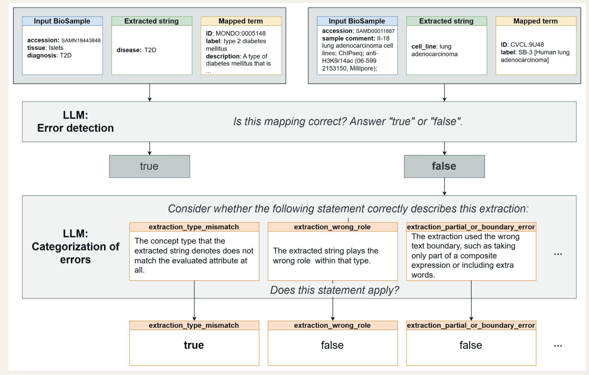

# Introduction

BioSample is a repository containing tens of millions of records describing biological materials used in experiments across a wide range of studies. Each BioSample record contains metadata about the sample, submitted primarily as key--value pairs. This flexible structure accommodates diverse experiments, but also results in substantial variation in how biological information is represented, including differences in field names, terminology, abbreviations, and free-text descriptions. As a result, information describing the same biological concepts can be difficult to identify and integrate across records, limiting the ability to search, analyse, and reuse BioSample metadata at scale [@citesAsEvidence:Goncalves2019; @citesAsEvidence:Bernstein2017].

Rule-based approaches can resolve some of these differences, but are limited when relevant information is expressed in heterogeneous free text or requires interpretation in the context of the complete BioSample record. In our previous work, we showed that large language models (LLMs) could be used to extract biological information from BioSample metadata and map the extracted values to ontology terms, focusing primarily on cell lines [@extends:Ikeda2025]. The resulting pipeline consists of three main stages: (1) an LLM extracts values corresponding to the target attributes from the metadata in each BioSample record; (2) ontology-based string search retrieves candidate ontology terms and directly assigns an ontology term when an unambiguous exact label or synonym match is found; and (3) when candidate selection remains necessary, an LLM selects the appropriate ontology term from the retrieved candidates or rejects all candidates. We subsequently reimplemented and expanded this approach to nine target attributes: cell line, cell type, tissue, disease, drug, knockout gene, knockdown gene, overexpressed gene, and ChIP antigen, and extended its scope to human and mouse RNA-seq and epigenomic records. We also optimised the execution of locally hosted LLMs to enable the processing of millions of BioSample records within a practical timeframe. Prior to the BioHackathon, this approach had been applied to approximately 4.2 million BioSample record instances, producing a harmonised collection of extracted and ontology-mapped metadata.

At the DBCLS BioHackathon 2026, we extended this resource in three directions. First, we developed an alpha version of an interactive web application for searching the harmonised BioSample collection using ontology terms and visualising the characteristics of selected subsets. The application is intended to facilitate the discovery of samples of interest and the exploration of experimental conditions that may be difficult to identify through conventional field-based searches.

Second, we developed a provenance-tracing procedure to link values extracted by the LLM to supporting evidence in the original BioSample records. In addition to making the source of individual extracted values inspectable, this allowed us to examine which submitted field names contain the information represented by each target attribute and to characterise the heterogeneity of these fields across the collection. The resulting provenance information is also exposed in the visualisation application, allowing users to inspect the evidence associated with individual extracted values.

Third, we used LLMs to evaluate extraction and ontology-mapping errors. Manual evaluation of millions of mappings is not feasible, so we developed an LLM-assisted procedure to assess individual results and, when errors were identified, classify their causes. We applied this approach to compare mapping results generated with Mistral-small3.1:24B and Qwen3.8:27B, examining both the proportion of mappings assessed as correct and the types of errors identified for each model. The evaluation showed improved results for the latter model, and also provided insights into which types of errors were reduced.

Here, we describe the resulting search and visualisation application, provenance analysis, and LLM-assisted evaluation. We use these approaches to examine how the structured BioSample metadata can be explored, how reliably extracted values can be traced to their source, how the relevant information is represented across submitted BioSample fields, and what types of extraction and ontology-mapping errors remain.

# Implementation

## Input LLM-generated BioSample metadata resource

The analyses presented here use a pre-existing resource of structured BioSample metadata generated before the BioHackathon by our new bsllmner-mk2 pipeline (<https://biosampleplus.s3.ap-northeast-1.amazonaws.com/index.html>). The release is an RO-Crate that was produced by applying the expanded extraction and mapping pipeline introduced above to human and mouse RNA-seq and epigenomic BioSample records. It contains the original BioSample metadata, structured extractions, ontology mappings, and run-level provenance. The same LLM, mistral-small3.1:24b, was used for metadata extraction and, when required, selection among candidate mappings. The release comprises 4,187,708 BioSample accessions (Table \ref{tab:input}). 1,331 samples were used for both RNA-seq and epigenetic experiments, and included in the count of both.

Table: The number of samples of each data type used for the analyses. DDBJ RNA-Seq refers to RNA-Seq BioSamples retrieved via DDBJ Search, rather than BioSamples submitted to DDBJ. \label{tab:input}

| Acquisition stream | Organism | Input record instances |
| :----------------- | :------- | ---------------------: |
| DDBJ RNA-Seq | *Homo sapiens* | 2,097,428 |
| DDBJ RNA-Seq | *Mus musculus* | 1,724,474 |
| ChIP-Atlas | *Homo sapiens* | 179,015 |
| ChIP-Atlas | *Mus musculus* | 188,122 |
| **Total** | | **4,189,039** |

For the error analysis, the mapping results of ChIP-Atlas human samples generated with Qwen3.8:27B were also used. The sample size remains 179,015 as shown in Table \ref{tab:input}, but it should be noted that a minor modification has been made to the pipeline itself (a condition to bypass the fuzzy matching step has been added) since it was run with Mistral-small3.1:24B.

## The error analysis of the ontology mapping results

An overview of the process for evaluating mapping results using an LLM as an evaluator, including correctness assessment and categorization of incorrect mappings, is shown in Fig. \ref{fig:flowchart}. In the first step, the LLM receives a triplet consisting of a BioSample entry, the string extracted by the mapping pipeline, and the ontology term assigned as the mapping result, and returns only either "true" or "false" to indicate whether the mapping is correct. Results judged as "false" proceed to the categorization step. In this step, the LLM is provided with the input triplet and the definitions of the categories, and is asked to determine whether the mapping should be assigned to each category. The category definitions are shown in Table \ref{tab:categories}. Because this step requires careful consideration, the LLM was also instructed to provide the rationale for its judgment. In addition to the categories listed in Table \ref{tab:categories}, we also included a determination regarding whether the mapping was valid. Since the initial true/false classification was a simplified process, the mappings classified as "false" inevitably include a significant number of actually correct ones. Therefore, we defined the mappings ultimately judged as "correct" by the LLM as those that were either determined to be "true" in the first step or were classified into the "valid" category without falling into any of the incorrect answer categories.

Based on our previous results, we expected that a large proportion of the mappings would be correct. Therefore, we designed the first step to require only a minimal response and to rapidly filter out mappings that were likely to be correct, so that only a small number of potentially problematic mappings would proceed to the more detailed examination in the second step. This design was intended to enable the processing of a large number of samples. The LLM used as the evaluator was Qwen3.8:27B.

In this study, we considered only samples for which a mapping to an ontology term was obtained. Cases in which a sample should ideally have been mapped to a specific term but no mapping was obtained were not evaluated.

{ width=100% }

Table: The definitions of the error categories. \label{tab:categories}

| Category | Description |
| :-------------------------------- | :------------------------------------------------------------ |
| extraction_type_mismatch | The concept type that the extracted string denotes does not match the evaluated attribute at all. ... Examples include extracting a drug or other treatment reagent as knockout_gene, a tissue name as disease, a disease mention as cell_type or tissue, or a treatment reagent as disease. |
| extraction_wrong_role | The concept type that the extracted string denotes does match the evaluated attribute, but the extracted string plays the wrong role or belongs to the wrong sub-classification within that type. Examples include extracting a ChIP target, assay target, antibody target, transgene, or measured gene as knockout_gene, knockdown_gene, or overexpressed_gene when the metadata shows it was not actually knocked out, knocked down, or overexpressed; or extracting a stem cell line or other source cell line mentioned in the metadata as cell_line when the actual sample is a differentiated cell derived from that cell line rather than the original cell line itself. |
| extraction_partial_or_boundary_error | The extraction used the wrong text boundary, such as taking only part of a composite expression or including extra words. |
| extraction_hallucination | The extracted string does not appear as a substring in any of the BioSample attributes, Ids, description, or title, and appears to be generated through hallucination. |
| ambiguous_source_metadata | The BioSample metadata itself is ambiguous, contradictory, or too underspecified for reliable interpretation, even for a human reviewer. |
| selection_failed_to_reject | The candidate list below is the full set of ontology candidates that the bsllmner-mk2 selection step actually had to choose from for this value. None of them, including the one that was ultimately chosen, is an appropriate match for the BioSample metadata, and the selection step should have rejected all candidates instead of producing a final mapping. |
| selection_better_candidate_available | The candidate list below is the full set of ontology candidates that the bsllmner-mk2 selection step actually had to choose from for this value. A candidate other than the one that was chosen is a more appropriate match for the BioSample metadata, but the selection step picked the wrong one instead. |

## Selection of samples for the categorization test

We evaluated the mapping results obtained using each of Mistral-small3.1:24B and Qwen3.8:27B for human epigenomic experiments using the LLM-based correctness assessment and categorization process. Among the 179,015 samples, we first filtered the samples to ensure that no two samples from the same BioProject were included. We further filtered the samples to ensure that, for the results obtained using Mistral-small3.1:24B, no two mappings with the same extracted string were included. The numbers of mappings evaluated for each attribute are shown in Table \ref{tab:testset}.

Table: The number of mappings of each attribute used for the categorization test. \label{tab:testset}

| Attribute | Number of mappings |
| :----------------- | -----: |
| cell_line | 1487 |
| cell_type | 1626 |
| disease | 561 |
| drug | 653 |
| knockdown_gene | 649 |
| knockout_gene | 601 |
| overexpressed_gene | 759 |
| tissue | 510 |

## Cascaded provenance tracing of extracted values

We developed a provenance-tracing procedure to link each extracted value to supporting evidence in the original BioSample record. To reduce computational cost and enable the approach to scale to more than 8 million extracted values, we used a sequential cascade in which deterministic matching methods were applied first, followed by locally hosted LLMs only for values that could not be linked to evidence deterministically.

The deterministic procedure used six matching strategies, applied sequentially until evidence was identified: exact, case-insensitive, normalised, bag-of-words, fuzzy, and ontology-synonym matching. Exact and case-insensitive matching searched for the extracted value at alphanumeric word boundaries, preventing short values from matching within unrelated longer strings (e.g. AP within applied). Normalised matching reconciled common formatting differences such as whitespaces, underscores, and a restricted set of genotype and construct notation. Bag-of-words matching identified consecutive multi-word expressions containing the same words in a different order. For fuzzy matching, words were compared using length-dependent edit-distance thresholds, with additional restrictions for strings containing digits to avoid matching biologically distinct identifiers such as HIF-1a and HIF-2a. The ontology-synonym strategy extended the search beyond the wording of the extracted value. When an ontology term had been assigned to the specific extracted value being checked, its label and synonyms were used as alternative search expression, using case-insensitive, normalised, bag-of-words, and fuzzy matching. Full matching rules are provided in Supplementary Table \ref{tab:s-rules}.

For each matching strategy, the procedure first searched the BioSample attributes, checking both field names and values. If no evidence was identified, the full BioSample record was searched. The cascade stopped at the first matching strategy that identified evidence and retained matches only from the first source group in which evidence was found. For each match, we recorded the source field, its complete text, the exact phrase within that text that produced the match, and the matching strategy used.

Values for which no supporting evidence was found using the deterministic approaches were assessed using LLMs. To select models for this stage, we used a reference set of 400 unresolved cases, each a distinct target attribute/extracted value pair uniformly sampled from the deterministic residual, and asked Claude Opus 5, run via parallel Claude Code subagent calls, to independently determine whether the extracted value was supported by the corresponding record and, when supported, identify the relevant evidence. Claude's assessments were used as reference annotations to compare three locally hosted models --- Qwen2.5-3B-Instruct, Qwen3-8B, and Qwen3-32B-AWQ. All three models were served locally using vLLM. Qwen3-32B-AWQ used a 4-bit AWQ-quantized checkpoint. Greedy decoding was used for all models (temperature 0, no sampling), with a 256-token output budget and a 3,072-token context window. Thinking was disabled for the two Qwen3 models.

Each locally hosted model received the extracted value together with the corresponding BioSample metadata and returned a found/not-found judgement. Positive predictions were required to include one or more verbatim quotations identifying the supporting text. Returned quotations were independently matched against the complete BioSample record using exact, case-insensitive, or normalised matching. A positive prediction was accepted only when every returned quotation could be verified in the source record. Based on the model comparison, Qwen3-8B was selected as the first LLM stage in the full provenance cascade, with Qwen3-32B-AWQ applied to values that remained unresolved.

# Results

## Development of a search and visualization system using the mapping results

We implemented a sample search and visualization system using the results of our ontology mapping pipeline. The system is accessible at the following URL: <https://bsllmner-viewer.ddbj.nig.ac.jp/>

Several screenshots of the system are shown in Fig. \ref{fig:viewer}. The most basic function is to specify an ontology term and display a list of samples to which the term has been mapped (Fig. \ref{fig:viewer}A). Another function combines two conditions, such as drug and disease, as the two axes and visualizes the number of samples satisfying each combination as a heatmap (Fig. \ref{fig:viewer}B). This enables users to explore experimental conditions that have been understudied but may be of interest. The system also allows users to display the distribution of attributes that were not selected within the selected conditions (Fig. \ref{fig:viewer}C), as well as the annual trend in the number of submissions for samples satisfying the selected conditions (Fig. \ref{fig:viewer}D). Each count can also be switched from the sample level to the BioProject level. This option can be used when generating visualizations in which bias caused by differences in the number of samples per project may be an issue. For each extracted value, the application also shows the supporting field and text identified by provenance tracing (see "Provenance tracing of extracted values").

![Screenshots of the sample search and visualization system. (A) Results of selecting liver as the tissue and searching for liver samples from human RNA-seq experiments. (B) Heatmap showing the number of human RNA-seq samples to which the selected ontology terms were mapped, with 10 disease terms and 10 drug terms specified. (C) Distribution of the experimental conditions investigated under Kras knockout in mouse RNA-seq samples, with Kras specified as the knockout gene. (D) Line graph showing the annual number of submissions of human lung RNA-seq samples. \label{fig:viewer}](./fig2_viewer_screenshots.png){ width=100% }

## Categorization of LLM's errors

LLMs can make mistakes. In our previous work, we manually constructed a gold-standard dataset for cell lines and used it to evaluate the correctness of the mapping results. However, manually constructing a gold-standard dataset for each expansion of the target species or mapping ontologies would be labor-intensive. We therefore investigated the use of an LLM to evaluate the correctness of mapping results.

We performed a correctness assessment in two steps, as shown in Fig. \ref{fig:flowchart}. To evaluate the validity of this design, we first compared the results of the first-step correctness assessment with the evaluation against the cell-line gold-standard dataset used in our previous work (Table \ref{tab:gold}). We evaluated 318 samples from the mapping results generated by Mistral-small3.1:24B that had been mapped to some cell-line term.

If the LLM incorrectly judges an erroneous mapping to be correct, the mapping will not proceed to the subsequent detailed examination process, making such false-positive judgments particularly problematic. We confirmed that this occurred in only 2 of the 318 cases. Conversely, the LLM judged 59 of the 318 actually correct mappings to be incorrect. Although this number was relatively large, these cases can potentially be identified as correct in the subsequent categorization process and therefore do not pose a major problem. Based on these observations, we considered the two-step design consisting of correctness assessment followed by categorization to be appropriate.

We applied correctness assessment and categorization into the categories shown in Table \ref{tab:categories} to the numbers of mappings for each attribute shown in Table \ref{tab:testset}. The validity of the categorization itself was not independently evaluated. We performed the correctness assessment and categorization on the mapping results generated by both Mistral-small3.1:24B and Qwen3.8:27B and compared the results.

The proportions of mappings judged to be correct by the LLM are shown in Table \ref{tab:accuracy}. For every attribute, the results generated by Qwen3.8:27B were judged to have a higher proportion of correct mappings than those generated by Mistral-small3.1:24B.

The categorization results are shown in Tables \ref{tab:cat-mistral} and \ref{tab:cat-qwen}. A notable difference was the substantial reduction in the number of mappings classified as selection errors in the Qwen3.8:27B results compared with the Mistral-small3.1:24B results. A typical error observed in the Mistral results was that the model often selected some term as the final mapping even when none of the candidate terms was appropriate. The reduced number of selection errors in the Qwen3.8:27B results is consistent with this observation. This suggests an expected benefit of using a more capable model such as Qwen3.8:27B.

Another notable finding was the relatively large number of mappings classified as wrong role errors for the knockdown_gene, knockout_gene, and overexpressed_gene attributes. In such cases, for example, a gene name that was actually the target of a ChIP experiment was incorrectly extracted as a knockout gene. Although the number of such errors was reduced with Qwen3.8:27B compared with Mistral-small3.1:24B, a substantial number remained. This finding suggests one area for future improvement of the mapping pipeline.

Further investigation of the results is warranted.

Table: Comparison of evaluation using the gold-standard set and the LLM. Rows show the first-step LLM evaluation; columns show the gold-standard evaluation. \label{tab:gold}

| LLM evaluation | Gold standard: correct | Gold standard: wrong |
| :------------- | ---------------------: | -------------------: |
| Correct | 219 | 2 |
| Wrong | 59 | 38 |

Table: Accuracy of the mappings by two models, evaluated by Qwen3.8:27B. \label{tab:accuracy}

| Attribute | Mistral-small3.1:24B | Qwen3.8:27B |
| :----------------- | ----: | ----: |
| cell_line | 0.836 | 0.920 |
| cell_type | 0.645 | 0.865 |
| disease | 0.938 | 0.969 |
| drug | 0.766 | 0.939 |
| knockdown_gene | 0.881 | 0.935 |
| knockout_gene | 0.710 | 0.883 |
| overexpressed_gene | 0.552 | 0.750 |
| tissue | 0.684 | 0.757 |

```{=latex}
\begingroup\scriptsize
```

Table: The categorization of mapping results by Mistral-small3.1:24B. Column abbreviations: ambig., ambiguous source; wrong role; boundary, boundary error; halluc., hallucination; type mism., type mismatch; extr. valid, extraction valid; better cand., better candidate missed; fail. rej., failed to reject; sel. valid, selection valid. The "total" column means the total number of mappings evaluated and "initial NG" means the number of mappings judged as wrong in the first step of categorization. \label{tab:cat-mistral}

| Attribute | ambig. | wrong role | boundary | halluc. | type mism. | extr. valid | better cand. | fail. rej. | sel. valid | total | initial NG |
| :---------------------------- | ------: | ------: | ------: | ------: | ------: | ------: | ------: | ------: | ------: | ------: | ------: |
| cell_line | 4 | 71 | 44 | 1 | 20 | 555 | 12 | 85 | 159 | 1487 | 626 |
| cell_type | 5 | 44 | 128 | 63 | 171 | 633 | 56 | 131 | 333 | 1626 | 768 |
| disease | 0 | 2 | 3 | 7 | 2 | 65 | 5 | 10 | 36 | 561 | 71 |
| drug | 1 | 11 | 31 | 8 | 9 | 120 | 10 | 72 | 23 | 653 | 186 |
| knockdown_gene | 2 | 26 | 25 | 8 | 3 | 45 | 1 | 4 | 5 | 649 | 108 |
| knockout_gene | 1 | 104 | 30 | 12 | 0 | 54 | 0 | 2 | 8 | 601 | 202 |
| overexpressed_gene | 3 | 251 | 44 | 14 | 4 | 119 | 2 | 2 | 32 | 759 | 387 |
| tissue | 4 | 15 | 21 | 13 | 64 | 146 | 6 | 16 | 95 | 510 | 219 |

Table: The results of categorization of mapping results by Qwen3.8:27B. Column abbreviations are as in Table \ref{tab:cat-mistral}. The "mapped" column means the number of samples that any ontology term of the attribute was mapped. "mapped and initial NG" means the number of mappings judged as wrong in the first step of categorization. \label{tab:cat-qwen}

| Attribute | ambig. | wrong role | boundary | halluc. | type mism. | extr. valid | better cand. | fail. rej. | sel. valid | total | mapped | mapped & initial NG |
| :---------------------------- | ------: | ------: | ------: | ------: | ------: | ------: | ------: | ------: | ------: | ------: | ------: | ---------: |
| cell_line | 8 | 61 | 60 | 2 | 1 | 398 | 2 | 2 | 62 | 1487 | 1277 | 427 |
| cell_type | 5 | 43 | 78 | 11 | 3 | 183 | 6 | 1 | 94 | 1626 | 970 | 213 |
| disease | 0 | 3 | 5 | 3 | 1 | 37 | 2 | 1 | 16 | 561 | 516 | 40 |
| drug | 1 | 4 | 7 | 3 | 1 | 30 | 1 | 2 | 9 | 642 | 508 | 51 |
| knockdown_gene | 0 | 12 | 18 | 2 | 1 | 37 | 0 | 0 | 0 | 641 | 581 | 66 |
| knockout_gene | 2 | 6 | 25 | 2 | 0 | 27 | 0 | 0 | 1 | 579 | 367 | 62 |
| overexpressed_gene | 3 | 73 | 29 | 4 | 1 | 71 | 0 | 1 | 12 | 732 | 492 | 160 |
| tissue | 3 | 26 | 56 | 20 | 3 | 116 | 1 | 1 | 37 | 510 | 391 | 136 |

```{=latex}
\endgroup
```

## Preparing for searches using cross-reference information between ontologies

Mapping BioSample entries to ontology terms should also enable searches that make use of cross-reference information to other ontologies associated with those ontology terms. However, the properties and schemas used to describe cross-references to other ontologies vary across ontologies.

We therefore decided to use the API of TogoID [@usesMethodIn:Ikeda2022], an ID conversion service operated by DBCLS, as the backend of our system. TogoID collects link information from various biological databases and ontologies and enables users to retrieve links between IDs in a unified format.

The ID relations shown in Table \ref{tab:togoid} were obtained from the respective ontologies and made available through TogoID. The information on which tissues contain particular cells, as described in the Cell Ontology and UBERON, differs between the two ontologies. Therefore, in our sample search system, we decided to use a merged mapping table incorporating information derived from both ontologies.

Table: ID relations collected and registered in TogoID for implementing search using the cross-reference information. \label{tab:togoid}

| Source | Target | Use case |
| :------------ | :------------ | :----------------------------------------------------- |
| Cellosaurus | Cell Ontology | Given a cell name, search for cell line samples derived from that cell. |
| Cellosaurus | UBERON | Given a tissue name, search for cell line samples derived from that tissue. |
| MONDO | Cell Ontology | Given a cell name, search for samples associated with diseases occurring in that cell. |
| MONDO | UBERON | Given a tissue name, search for samples associated with diseases occurring in that tissue. |
| Cell Ontology | UBERON | Given a tissue name, search for samples of cells contained in that tissue. |
| UBERON | Cell Ontology | Same as above. |

For example, to retrieve Cellosaurus IDs of cell lines derived from the nervous system (UBERON:0001016) through the TogoID API, the following URL can be used:

<https://api.togoid.dbcls.jp/convert?route=uberon,cellosaurus&ids=UBERON%3A0002048&report=all>

Another use case envisioned for the search system is to search for cell line samples associated with a disease by entering the disease name. Although our system uses MONDO as the disease ontology, the ontologies used in Cellosaurus to describe diseases associated with cell line origins are the NCI Thesaurus and Orphanet. Because TogoID supports multi-step ID conversion, we decided to support this use case by mapping MONDO IDs to the corresponding Cellosaurus IDs via the NCI Thesaurus and Orphanet. The ID relations required for these conversions were already available in TogoID.

## Provenance tracing of extracted values

To identify which fields in the original BioSample metadata supported the values extracted by our pipeline, we traced each value back to its source record, using a cascade of methods from fast deterministic approaches to LLM-based checks for the unresolved cases.

Across 8,194,813 extracted values, exact matching identified supporting evidence for 7,072,471 values (86.3%). The remaining deterministic stages increased cumulative coverage to 7,877,119 values (96.1%), leaving 317,694 values (3.9%) for the LLM stages. Qwen3-8B resolved a further 155,901 values (1.9%), followed by an additional 82,816 values (1.0%) with Qwen3-32B-AWQ. Overall, 99.0% of extracted values were linked to supporting evidence, leaving 78,977 (1.0%) unresolved.

The contribution of each provenance stage differed across target attributes (Fig. \ref{fig:provenance}). Literal matching accounted for a particularly large fraction of values for cell line, ChIP antigen, and drug, whereas genetic-perturbation attributes and cell type more often required later stages. Nevertheless, deterministic procedures accounted for most values linked to supporting evidence for every target attribute.

{ width=80% }

## Evaluation of LLM-based provenance tracing

The deterministic stages of the provenance tracing cascade left 317,694 values with unresolved provenance. Applying a large model to this entire set would be computationally expensive, so we assessed the ability of smaller LLMs to identify supporting evidence reliably. We thus compared the ability of three LLMs against a set of 400 reference annotations assessed by Claude Opus 5 (Table \ref{tab:provenance-llm}).

Qwen2.5-3B was discarded due to its low performance (16.6% recall). Qwen3-8B and Qwen3-32B-AWQ achieved similar precision, at 94.0% and 93.3%, respectively, while the larger model recovered a greater proportion of supported values (71.4% versus 56.9% recall). Based on this comparison, Qwen3-8B was used as the first LLM stage, with Qwen3-32B-AWQ applied only to values that remained unresolved. This reduced the number of values requiring the larger model while retaining its higher recall.

Table: Agreement of LLM-based provenance assessment with the Claude Opus 5 reference annotations on 400 values unresolved by the deterministic procedure. \label{tab:provenance-llm}

| Model | Precision | Recall | Accuracy |
| :------------------ | ----: | ----: | ----: |
| Qwen2.5-3B-Instruct | 98.2% | 16.6% | 30.5% |
| Qwen3-8B | 94.0% | 56.9% | 61.3% |
| Qwen3-32B-AWQ | 93.3% | 71.4% | 72.0% |

Review of the same 400 cases also identified the main reasons why deterministic matching failed. The most frequent were values whose letters were directly fused to a prefix or suffix with no separator (195/400, 48.8%), abbreviations (49/400, 12.2%), rewording or alternative word forms (46/400, 11.5%), cases requiring domain knowledge beyond the record (24/400, 6.0%), misspellings below the fuzzy-matching threshold (22/400, 5.5%), and a word or phrase inserted between parts of the value (20/400, 5.0%). Ten of the 400 reviewed values (2.5%) had no identifiable support in the source record, and 7 (1.8%) combined more than one target attribute into a single extracted value. Representative examples of these failure modes are provided in Supplementary Table \ref{tab:s-failures}.

## Extracted information is distributed across a long tail of submitted field names

We used the provenance links to determine which submitted BioSample field names contained evidence for the nine target attributes. Across the dataset, evidence was associated with 6,268 distinct submitted field names, but its distribution was highly concentrated: 32 field names accounted for 90% of all identified evidence.

The number of field names required to account for 90% of evidence varied substantially among target attributes, from only nine field names for cell type and tissue, to 110 for knockdown gene (Fig. \ref{fig:fieldnames}A). The representation of the target attributes in submitted metadata therefore combines a relatively small set of common field names with a long tail of less frequently used alternatives.

To examine changes over time without combining acquisition streams with different collection histories, field-name use was analysed solely for the RNA-Seq BioSamples retrieved via DDBJ Search, excluding the ChIP-Atlas-derived BioSamples. The total number of distinct fields rose proportionally to the number of published projects until 2020, with an unexpected peak in 2021 --- nearly double the 2020 value (Fig. \ref{fig:fieldnames}B). Since then, the number of unique fields per year has stabilised, while the number of published BioProjects per year keeps going up (Fig. \ref{fig:fieldnames}B).

We further analysed the big increase in unique fields in 2021. Unique fields are concentrated mostly in cell line, overexpressed gene, and knockout gene. We ruled out the cause being due to a small number of badly-structured BioProject submissions: these fields were distributed across 465 BioProjects and 398 submitting laboratories rather than being dominated by a small number of contributors. These observations are compatible with a change in the composition of RNA-seq submissions during this period, including increased representation of single-cell and genetic-perturbation experiments, but the analysis is descriptive and does not establish a causal explanation for the 2021 peak.

![Heterogeneity of submitted BioSample field names. (A) Number of distinct field names required to account for 90% of provenance evidence for each target attribute, split into the core needed for 90% coverage, names reused across more than one BioProject, names confined to one BioProject, and names confined to one BioSample (a BioSample with no linked BioProject counts as its own singleton BioProject). Numbers at the first boundary give the names needed for 90% coverage; numbers at bar ends give total distinct names. (B) Mean annual number of distinct field names observed across the nine target attributes in DDBJ RNA-seq BioSample records, 2012--2025, with the annual number of published BioProjects shown for comparison. \label{fig:fieldnames}](./fig4_field_name_heterogeneity.png){ width=100% }

# Discussion

During the BioHackathon, we extended our previous work on extracting and ontology-mapping biological information from heterogeneous BioSample metadata using LLMs. Here, we focused on three aspects that affect the usability of our results: providing access to the harmonized metadata through search and visualization, tracing extracted values back to evidence in the original BioSample records, and evaluating errors in extraction and ontology mapping.

Through the development of the search and visualization application, we have achieved one of our major goals: making the results obtained using our pipeline widely accessible to users. By representing heterogeneous descriptions through ontology terms, users can search BioSample using harmonized biological concepts rather than relying on the field names and terminology used in individual records. This is particularly relevant given the field-name heterogeneity identified in our provenance analysis: biologically related information can occur under many different submitted field names, making searches restricted to predefined fields insufficient to recover all relevant records. The currently released system is still an alpha version, and we plan to further refine it as additional validation is conducted. One planned improvement is to enable searches that make use of cross-reference information between ontologies by utilizing the ID relations registered in TogoID. So far, large-scale application of the ontology mapping pipeline has been limited to human and mouse samples. We plan to expand its application to additional species and incorporate the resulting mappings into the visualization system as they become available.

The two-stage error analysis provides a scalable way to assess these errors and investigate their causes. The validity of the categorization itself, however, has not yet been evaluated and remains an issue for future work. Although the results generated by Qwen3.8:27B were judged to be better than those generated by Mistral-small3.1:24B, it should be noted that Qwen3.8:27B was also used as the evaluator. Thus, the possibility that the evaluator may favor the reasoning underlying mappings generated by Qwen3.8:27B cannot be excluded. Because error categorization is performed on a relatively small number of samples, using a larger model as the evaluator may be worth considering. In addition, the Qwen3.8:27B mappings were generated with a later revision of the pipeline that changed how exact label and synonym matches are handled during candidate selection, so the observed differences reflect both the model and the pipeline revision. More generally, both the provenance benchmark and the mapping-error analysis rely on LLM judgments that have not yet been independently validated by human experts. Human assessment of a subset of cases will therefore be needed to establish the reliability of these evaluations and determine whether particular errors are systematically missed or misclassified by the LLM evaluators.

The categorization results have not yet been examined in sufficient detail. Nevertheless, even from an investigation of a limited number of examples, several interesting trends could be observed. Although LLM-based categorization cannot provide completely objective results, it can be useful for identifying trends by attribute or by model without the need to manually construct a new gold-standard dataset. When the ontology mapping pipeline is expanded to additional species, this approach may help detect inappropriate mappings that were not anticipated and thereby contribute to improving the quality of the data made publicly available.

The provenance analysis also allowed us to quantify the heterogeneity of the field names from which biological information was extracted. Although 31 field names accounted for 90% of the identified evidence, the remaining evidence was distributed across thousands of additional field names, showing that approaches relying on a predefined set of commonly used fields miss relevant samples whose biological information is recorded elsewhere in the metadata. Although this issue had also been suggested in our previous work using a limited number of specific examples, the present investigation using large-scale mapping results demonstrated that this heterogeneity is a broader phenomenon.

These results provide further support for the need for an approach in which LLMs flexibly determine which strings should be extracted: such approaches can recover biological information from already-submitted records despite inconsistent field names and terminology. However, retrospective harmonization does not address the source of that inconsistency. More consistent use of field names and existing metadata structures at submission would reduce the amount of subsequent harmonization required and facilitate direct reuse of the metadata. Our temporal analysis suggests that the total diversity of field names may be stabilizing despite continued growth in the number of RNA-seq experiments, but new field names continue to appear, many of them restricted to a single BioProject. Improving the reusability of BioSample metadata therefore requires both retrospective and prospective harmonization: retrospective harmonization to make existing heterogeneous records more consistent and reusable, as explored in this work, and prospective harmonization to improve consistency at the point of data collection and submission.

# References

```{=latex}
\AtEndDocument{%
```

# Supplementary Material

```{=latex}
\setcounter{table}{0}
\renewcommand{\thetable}{S\arabic{table}}
```

Table: Provenance-matching rules and examples. \label{tab:s-rules}

| Stage | Final rule | Example |
| :---------------- | :------------------------------------------------------- | :--------------------- |
| Exact | Case-sensitive literal matching of the extracted value. Matches must occur at alphanumeric word boundaries: the characters immediately before and after the match, when present, cannot be alphanumeric. | DLD-1 $\rightarrow$ DLD-1 cell line |
| Case-insensitive | Same as exact matching after lowercasing the query and source text, retaining the same alphanumeric word-boundary requirement. | HeLa $\rightarrow$ Hela-S3 |
| Normalised | Both strings are lowercased and compared under three normalisation variants: (1) runs of spaces, tabs, newlines, carriage returns, hyphens, and underscores are collapsed to one space, with bracketed content in `()`, `[]`, or `{}` removed; (2) the same separators are removed entirely, with bracketed content removed; and (3) separators are collapsed to one space while bracket characters are removed but their contents are retained. Slashes and other punctuation are not normalised. Normalised queries shorter than four characters are rejected. Matches must retain alphanumeric word boundaries, except when the adjacent fused token is a recognised genotype/construct affix (KO, ko, CKO, cKO, fl, f, flox, LSL, GFP, eGFP, OE, KD, wt, Cre, IRES, lox, delta, del, s, sh, si, sg, TRE, or peg) or follows the point-mutation pattern `[A-Z][0-9]{1,4}[A-Z]`, such as G12D in KrasG12D. | CUDC-101 $\rightarrow$ CUDC 101 |
| Bag of words | Both strings are tokenised into Unicode-aware words. The query must contain at least two words, and a match requires a consecutive window containing exactly the same multiset of words, irrespective of order. No fuzzy matching or stop-word removal is applied at this stage. | LSD1 inhibitor $\rightarrow$ Inhibitor_LSD1 |
| Fuzzy | Both strings are tokenised into words and candidate matches must contain the same number of consecutive words in the same order. Words shorter than six characters must match exactly, case-insensitively. For words of at least six characters, the maximum Levenshtein distance is 1 for words shorter than 8 characters, 2 for words of 8--13 characters, and 3 for words of at least 14 characters. If either word contains digits, the digit sequences must be identical and the maximum edit distance is 1 regardless of word length. A separate single-character visual-confusion rule permits l/I/1 and o/O/0 substitutions. | erythroid $\rightarrow$ Erytrhoid |
| Ontology-derived matching | If the extracted value remains unresolved and has an ontology term assigned by the upstream pipeline to that specific value, the term's preferred label, exact synonyms, and related synonyms are used as alternative search expressions; no new ontology mapping is performed. These expressions are tested using exact, case-insensitive, normalised, bag-of-words, and fuzzy matching according to the rules above. Ontology-derived strings shorter than five characters are restricted to exact, case-sensitive matching. Applied last among the deterministic stages. | acute megakaryoblastic leukemia $\rightarrow$ acute megakaryoblastic leukaemia |
| Qwen3-8B | Semantic evidence search is applied to values unresolved by deterministic matching, first restricted to the submitted attributes and, if that fails, against the complete record. The model receives the extracted value and BioSample metadata and returns a found/not-found judgement together with verbatim supporting quotation(s) for positive predictions. Every returned supporting quotation must be re-located in the metadata supplied to the model using exact, case-insensitive, or normalised matching; otherwise the positive prediction is rejected. A positive verdict from the attributes-only pass is accepted directly; a positive verdict from the full-record pass is accepted only after independent confirmation by Qwen3-32B-AWQ. | prostate cancer $\rightarrow$ prostate tumor |
| Qwen3-32B-AWQ | The same semantic evidence-search, quotation-verification, and attributes-then-full-record procedure is applied to (a) values that remain unresolved after Qwen3-8B, and (b) as an independent check, values Qwen3-8B resolved only via its full-record pass --- of which 80.6% (28,378/35,194) were independently confirmed. | tissue heart $\rightarrow$ Human Cardiac Fibroblasts-Adult Atrial |
| Unresolved | No acceptable supporting evidence is identified by any deterministic or LLM stage, including a value whose only deterministic matches were all excluded for sitting in a negated context. | disease lung cancer with no supporting evidence |

Table: Failure modes in the 400-case provenance reference set. The categories describe why deterministic matching did not identify the relationship between the extracted value and the source metadata; they were assigned by Claude Opus 5 in the same annotation pass that produced the found/not-found reference judgement (Table \ref{tab:provenance-llm}), across all 400 reference cases. \label{tab:s-failures}

| Failure mode | Percentage | Example (Sample ID) |
| :---------------------------------- | ----------: | :------------------------------------------ |
| Value's letters directly attached to a prefix or suffix, no separator | 48.8% | knockout gene Trsp vs TrspN2_CR (SAMN50545886) |
| Abbreviation in source record | 12.2% | drug nivolumab vs Nivo (SAMN49991465) |
| Reworded phrase, word form, or punctuation | 11.5% | cell type CD45 positive cell vs CD45 positives cells (SAMN32817925) |
| Other | 6.8% | drug interleukin 35 found verbatim in a field the deterministic search did not cover (SAMEA6124270) |
| Requires domain knowledge beyond the record | 6.0% | cell type cholangiocyte with no matching text at all (SAMN14837113) |
| Misspelling outside fuzzy safety threshold | 5.5% | cell type Six2 positive cell vs Six2 possitive cells (SAMD00195589) |
| Word or phrase inserted between parts of the value | 5.0% | knockout gene Dnmt3b within Dnmt1/3a/3b-TKO (SAMN17036691) |
| No identifiable textual basis | 2.5% | disease congenital hypothyroidism unsupported anywhere in record (SAMN10283361) |
| Value combines multiple separate attributes | 1.8% | disease Bladder cancer assembled from a separate primary_cancer field reading Bladder (SAMN51178189) |

```{=latex}
}
```
